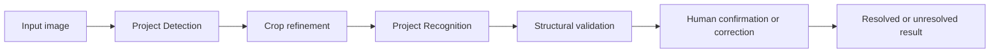

# ANPR Engine

ANPR Engine is a project-owned Turkish automatic number-plate recognition
research and demonstration pipeline. It combines plate Detection, crop
refinement, Recognition, structural validation, and explicit human review. The
public source repository accompanies a bounded demonstration; it is not a
public utility, high-availability service, or unattended production system.

> The owner reports that bounded processing of one authorized real JPEG or PNG
> was approved following consultation with a lawyer. A bounded demonstration
> is live at [anpr-engine.vibesofters.com](https://anpr-engine.vibesofters.com/).
> It is designed for purpose-limited processing, mandatory human review, and
> no intentional server-side image/result retention. This does not establish
> independent field accuracy, a capacity guarantee, or unattended production
> readiness.

## System boundary



The Detection and Recognition implementations are project-owned. Their design
uses established published concepts, which are cited in the technical
documentation. Third-party packages remain under their own licenses. Private
datasets and trained weights are not distributed and are not automatically
covered by the project-owned software license.

The detector is a one-class, anchor-free, multi-scale PyTorch implementation
with stride 8/16/32 features, FPN/PAN-style fusion, decoupled heads, focal-style
objectness loss, GIoU regression, dynamic assignment, and non-maximum
suppression. It is informed by established YOLO-family, FPN, PANet, focal-loss,
GIoU, and assignment research; it is not presented as architecturally
uninfluenced or wholly novel.

Four project Recognition families remain reproducible from public foundation
configurations:

1. CNN + BiLSTM + CTC — evaluated but not selected.
2. CNN + BiLSTM + Fixed Slots — evaluated.
3. CNN Tokenizer + Transformer + CTC — evaluated but limited by the governed
   project evidence.
4. CNN Tokenizer + Transformer + Fixed Slots — selected architecture.

Approved development-validation evidence for the selected family is 93.37%
raw/decoded exact accuracy, 98.96% character accuracy, 1.04% character error
rate, 98.98% length accuracy, and 98.47% type accuracy. These percentage-only
figures are not independent holdout, field, production, or reliability claims.

## Repository map

- `src/anpr_engine/` — project software and model definitions.
- `configs/recognition/` — sanitized four-family foundation configurations.
- `configs/public/` — safe public training and synthetic-fixture templates.
- `scripts/` — explicit local browser and Recognition training entry points.
- `schemas/` — versioned JSON Schema and OpenAPI contracts.
- `packages/api-contract/` — Phase 2A generated contract types, fixtures, and
  reviewed upload, privacy, retention, logging, and route policy artifacts.
- `apps/web/` — bilingual Next.js frontend and same-origin inference gateway.
- `deploy/` — container specifications and local/private staging configuration.
- `model-registry/public/` — curated public model identities and limitations.
- `tests/` — synthetic and architecture-level public checks.
- `docs/` — curated architecture, workflow, policy, and runtime documentation.
- `assets/fonts/` — separately licensed font assets retained for synthetic
  workflow reproducibility; they are not product branding.

Datasets, real images or transcriptions, model weights, private manifests, and
internal experiment evidence are not included.

The deployed private inference service is
internal-network-only, authenticates its Next.js gateway caller, holds one
verified model pair, processes one request at a time, and intentionally retains
no request content. See the
[private inference service](docs/operations/private-inference-service.md).

## Development setup

Python 3.11 or 3.12 and `uv` 0.12.5 are required.

```text
uv sync --locked --all-groups
uv run pytest
uv run ruff format --check src scripts tests
uv run ruff check src scripts tests
uv run mypy src
```

## Web candidate and real-image contracts

Versioned Draft 2020-12 and OpenAPI 3.1 contracts define the boundary for
one raw JPEG or PNG request. The provisional limits are 10 MiB compressed, 20
megapixels decoded, and 8,192 pixels per dimension. Multipart input, filenames,
paths, remote URLs, base64 JSON input, arbitrary media types, model selection,
and batches are prohibited. Generated Python and TypeScript representations are
checked deterministically against the schemas.

The live page defaults to English and switches its text to Turkish without
navigation. It has a same-origin upload route and a private Python inference
service. HTTPS and the trusted-proxy header were verified before public
processing was enabled. A five-attempt quota applies per client IP and
Europe/Istanbul calendar day; people sharing an IP share its quota. A bounded
synthetic end-to-end test passed, but sustained capacity and independent
field accuracy have not been established. Uploaded images
and results must not be intentionally retained or used for training, evaluation,
analytics, or dataset construction. Every prediction remains subject to human
review. See the [web workflow](docs/operations/web-frontend-bff.md) and
[live release record](docs/operations/public-coolify-release.md).

See the [development guide](docs/development/setup.md) for the complete public
check sequence.

## Local inference and browser review

Meaningful inference requires the owner to supply the two approved private
weights through an external model bundle. The runtime verifies their immutable
SHA-256 identities and fails closed on mismatch. The bundle must stay outside
the Git tree.

The retained Python browser is legacy local owner/development tooling. It binds
only to loopback and intentionally supports persistent multipart batch review.
Those behaviors are incompatible with the planned public service. The launcher
and its browser/review modules are explicitly excluded from every future public
deployment image and container entry point; public CI enforces that exclusion.

```text
uv run python scripts/launch_anpr_v1_browser.py \
  --repository . \
  --model-bundle /path/to/owner-controlled-model-bundle \
  --device cpu
```

Use only material you are legally authorized to process. Model predictions are
unresolved until a person confirms or corrects them. Structural validity and
confidence do not establish identity or ownership. See the
[private runtime guide](docs/operations/private-model-runtime.md).

## Sanitized Recognition training

The public training path can instantiate and train each disclosed Recognition
family with a user-supplied compatible dataset. Copy and select a safe template,
then provide explicit `train/` and `validation/` image/label directories. It
does not access a test or independent holdout, discover checkpoints, or resume
implicitly.

```text
uv run python scripts/train_recognition.py \
  --config configs/public/recognition-training-template.yaml \
  --dataset-root /path/to/authorized-dataset \
  --output /path/to/local-checkpoint.pt
```

Pass `--resume /path/to/checkpoint.pt` only when an explicit compatible resume
is intended. Read the [training workflow](docs/training/recognition-training.md)
before using non-synthetic data.

## Documentation

- [System architecture](docs/architecture/system-architecture.md)
- [Detection architecture and cited influences](docs/architecture/detection-architecture.md)
- [Recognition architecture families](docs/reference/recognition-four-family-summary.md)
- [Recognition training workflow](docs/training/recognition-training.md)
- [Evaluation methodology](docs/evaluation/methodology.md)
- [Private model runtime](docs/operations/private-model-runtime.md)
- [Privacy and responsible use](docs/policies/privacy-and-responsible-use.md)
- [Known limitations](docs/policies/public-candidate-limitations.md)
- [Public capability matrix](docs/reference/public-capability-matrix.md)

## Licensing, contributions, and security

Project-owned software code is released under the [Apache License 2.0](LICENSE).
See [NOTICE](NOTICE) for scope and third-party attribution. Private weights,
private datasets, real images/transcriptions, third-party dependencies, and
Barlow Condensed are not covered by the project's software license.

See the [contribution guide](CONTRIBUTING.md), [Code of Conduct](CODE_OF_CONDUCT.md),
and [security policy](SECURITY.md). Do not submit vulnerabilities through
public Issues. Send security and privacy/data incidents to
[erncnkr@gmail.com](mailto:erncnkr@gmail.com). The source repository is
[vibesofters/anpr-engine](https://github.com/vibesofters/anpr-engine).

Copyright © 2026 Eren Cankur.
